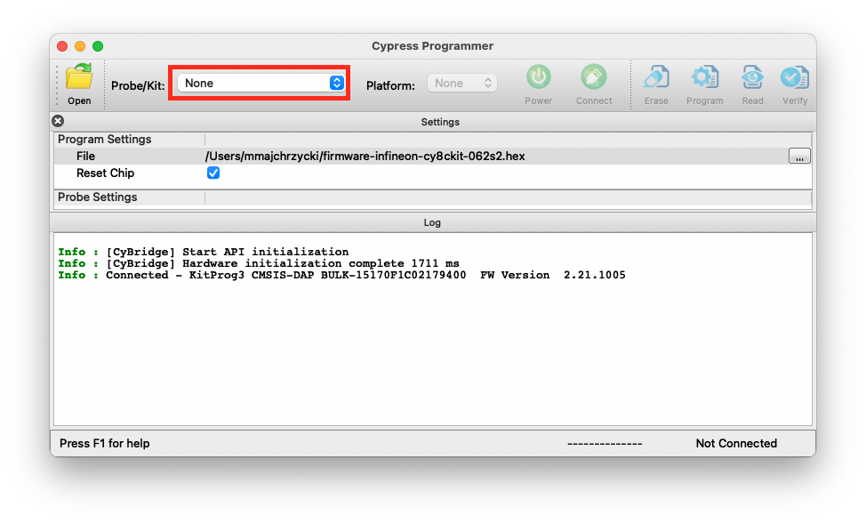
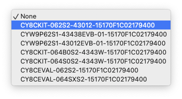
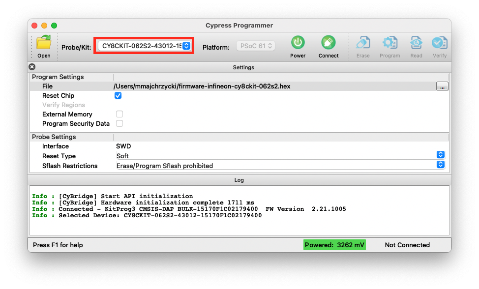
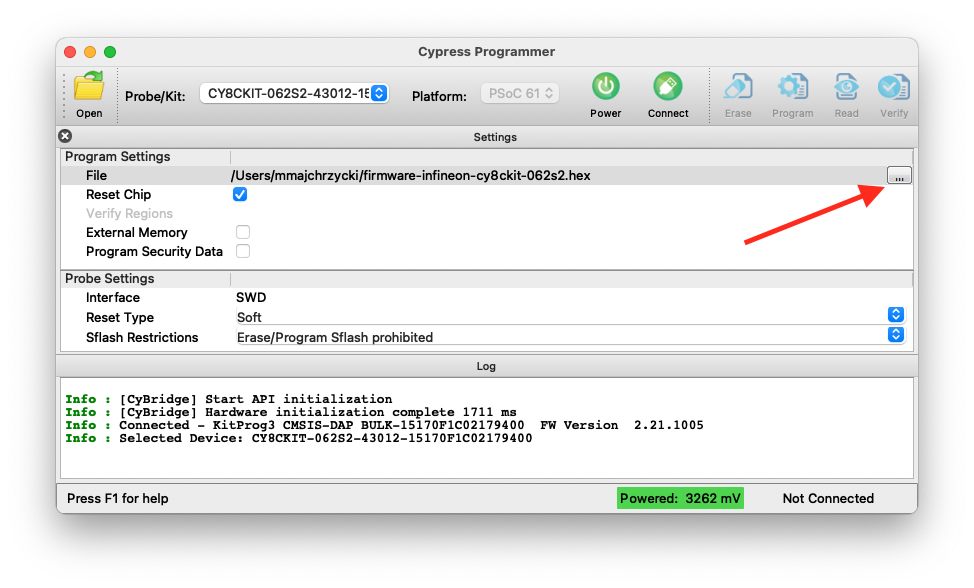
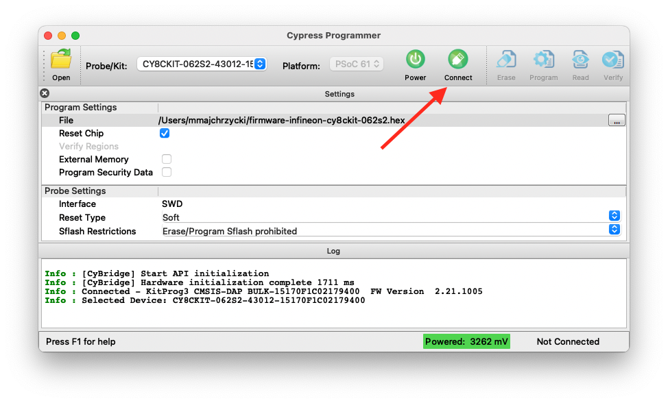
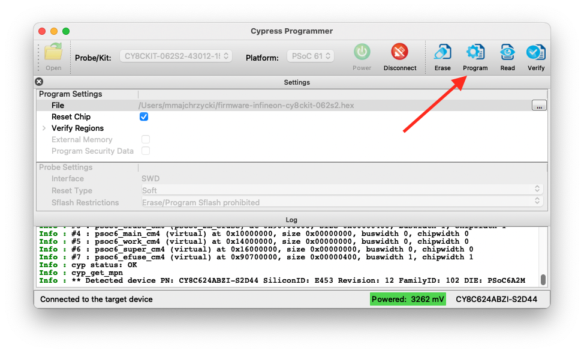

# EdgeImpulse example of Continious Motion Recognition using Infineon PSoC6

Edge Impulse enables developers to create the next generation of intelligent device solutions with embedded machine learning. This repository contains the Edge Impulse firmware for Infineon PSoC62 43012 Pioneer Kit with IoT SENSE Expansion Kit. This device supports all of Edge Impulse's device features, including ingestion, remote management and inferencing.

## Introduction

This project supports:
* Live inference using the [EdgeImpulse Studio](https://studio.edgeimpulse.com)
* Data ingestion with every sensor of the Infineon IoT Sense Expansion Kit (see Hardware)
    - Innertial sensor, BMX160 Accelerometer
    - Barometer sensor, DPS310 Barometer + Temperature sensor
    - Microphone, Dual PDM Mics
* Sensor Fusion for Inertial and Environment sensor
* Storing samples on the external NOR Flash using the QSPI inteface

## Requirements

### Software
- Install ModusToolbox SDK and IDE
- Toolchain in the SDK is GNU Arm® embedded compiler v9.3.1

### Hardware

- Development board: [PSoC 62S2 Wi-Fi Bluetooth pioneer kit](https://www.infineon.com/cms/en/product/evaluation-boards/cy8ckit-062s2-43012/) (`CY8CKIT-062S2-43012`)
- Evaluation board: [Infineon IoT Sense kit](https://www.infineon.com/cms/en/product/evaluation-boards/cy8ckit-028-sense/) (`CY8CKIT-028-SENSE`)

## Building

### ModusToolbox IDE

### Comammand Line

1. Install [ModusToolbox](https://www.raspberrypi.com/products/compute-module-4-io-board/)
1. Clone this repository.
1. Open terminal and go to the directory with cloned project
1. Run the following commands

    ```
    make getlibs
    make build
    ```

## Flashing

### ModusToolbox IDE

Infineon provides extensive documentation, with screenshots, about how to use the ModusToolbox IDE. Topics covered include:
- Importing a project
- Building the project
- Flashing the project to the board

Please visit this link for the [Infineon ModusToolbox IDE guide](https://www.infineon.com/dgdl/Infineon-Eclipse_IDE_for_ModusToolbox_User_Guide_1-UserManual-v01_00-EN.pdf?fileId=8ac78c8c7d718a49017d99bcb86331e8)

### Command Line

1. After building the firmware (see steps above) connect the board and run

    ```
    make program
    ```

### Standalone

1. Install [CyProgrammer](https://softwaretools.infineon.com/tools/com.ifx.tb.tool.cypressprogrammer)
1. Connect the board and run `CyProgrammer`
1. Select a probe/kit

    

    

    

1. Select compiled hex file with compiled firmware

    

1. Connect to the board

    

1. Program the firmware

    

1. After successful flashing, you should see a LED blinking patter

    

    


## Troubleshooting

### BMX160 chip ID

This project includes a modified version of the BMI160 library in order to have the expected CHIPID for BMX160(0xD8). The CHIPID was updated at BMI160_CHIP_ID in the `bmi160_defs.h` file.
